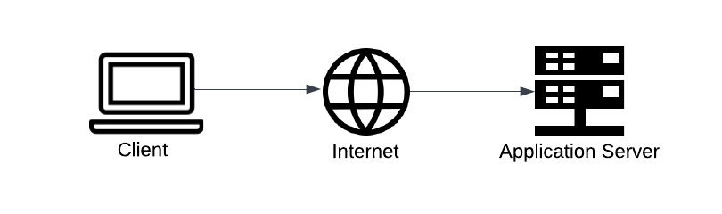

# Upward Bound


## **Overview**

### **Link**

*Coming soon*

### **Description**

Upward Bound is a program that provides academic and cultural enrichment opportunities for high school students from low-income families and/or first-generation college students. The program is designed to help students prepare for college and to succeed in their postsecondary education.

## **Development**

*Note: This is a work in progress. The following instructions are not yet complete and are subject to change as project development progresses.*

These instructions will get a copy of the project up and running on a local machine for development and testing purposes.

### **Installation and Setup**

You will need the following software installed on your machine prior to running the project. The links below will take you to the installation pages for each software.

* [Node.js](https://nodejs.org/en/)
* [Git](https://git-scm.com/)
* [VSCode](https://code.visualstudio.com/)
* [React.js](https://reactjs.org/)

### **Step 1: Prerequisites**

- [Node](https://nodejs.org/en/)
- [NPM](https://www.npmjs.com/)
- [VSCode](https://code.visualstudio.com/)
    - Install the appropriate language support for each language used in the project.
- [React.js](https://reactjs.org/)

### **Step 2: Clone the Repository**

- Navigate to the desired project directory on your computer.

- Clone the repository from [GitHub](https://github.com/build-umass/upward-bound.git) using the `git clone` command.

    ```bash
    $ git clone https://github.com/build-umass/upward-bound.git
    ```

- Navigate to the cloned repository directory.

    ```bash
    $ cd upward-bound
    ```
    or
    ```bash
    $ cd name-of-cloned-repository
    ```
### **Step 3: Install Dependencies**

- Check that the terminal is in the correct directory.

    ```bash
    $ pwd
    ```

- Install the dependencies using the `npm install` command.

    ```bash
    $ npm install
    ```
### **Step 4: Run the Application**

- Run the application using the `npm start` command.

    ```bash
    $ npm start
    ```
### **Step 5: View the Application**
- The command from Step 4 will locally host the website on `http://localhost:3000`.

## **System Architecture**

### **Overview**

Included in the repository is a file called `system-design.png`. This file contains a diagram of the current system design architecture for the project as shown below.

